# Charts

This directory contains every visualization generated in the analysis notebook
(`notebooks/games_project_Ədalət_Sadıqov.ipynb`), exported as standalone PNG
files directly from their original Plotly figure objects (no Matplotlib or
Seaborn was used anywhere in this project).

Charts are numbered in the order they appear in the notebook.

---

## 01. Games Released by Year

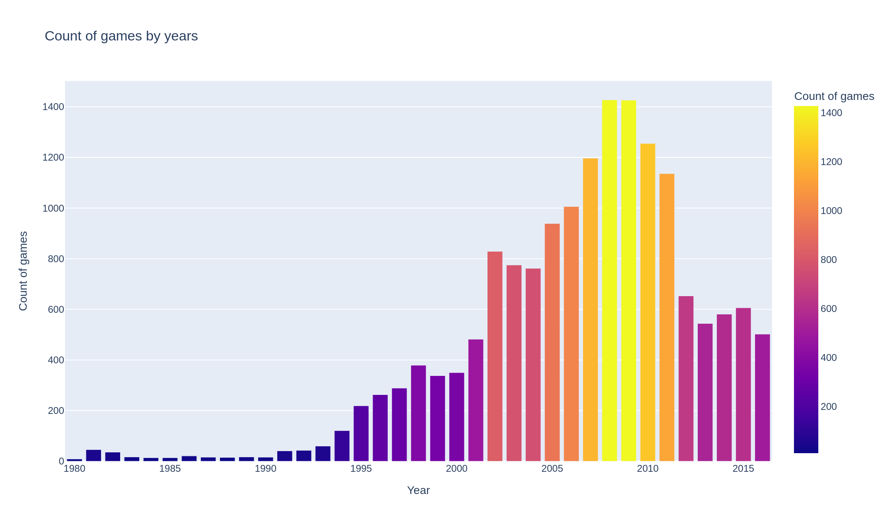

**Purpose:** Show how the volume of video game releases changed from 1980 to 2016.

**What It Shows**
- X-axis: Year of release
- Y-axis: Count of games released
- Color: Count of games (same as Y-axis, for visual emphasis)

**Key Insight:** Annual releases were low and flat from 1980–1993, increased
sharply from 1994 onward, and peaked at 1,427 games/year in 2008–2009, before
gradually declining through 2016.

**Interpretation:** The 2008–2009 peak coincides with the height of the PS3/X360/Wii
generation. The post-2012 decline may partly reflect incomplete data collection for
recent years rather than a true drop in industry output, since the dataset's later
years also show sharply rising rates of missing `critic_score`/`user_score`/`rating`
values.

---

## 02. Top 10 Platforms — All-Time Sales

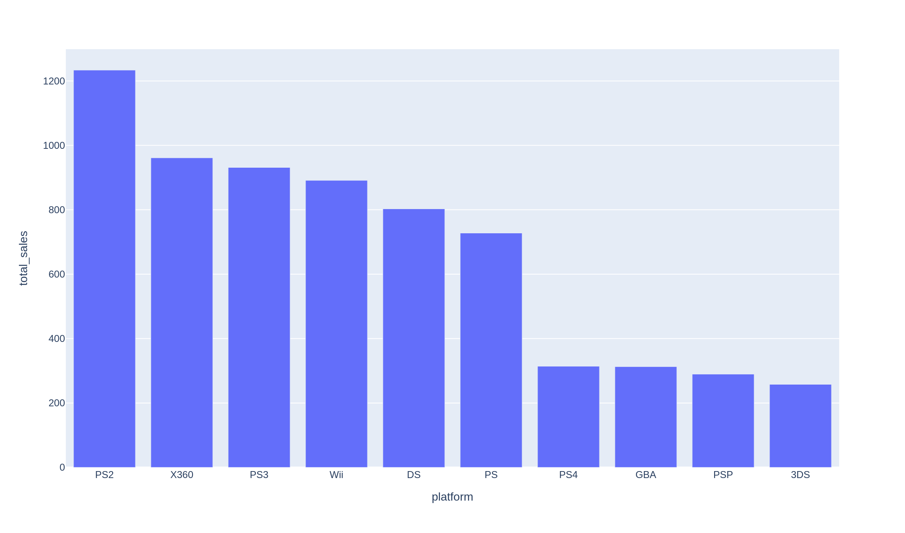

**Purpose:** Identify the platforms with the highest cumulative sales across the
entire 1980–2016 dataset, before narrowing the analysis to a more recent, relevant
period.

**What It Shows**
- X-axis: Platform
- Y-axis: Total sales (millions of copies, summed across all regions and years)

**Key Insight:** A small number of platforms (led by long-running console
generations such as PS2, X360, PS3, Wii, DS) account for the bulk of all-time
sales volume.

**Interpretation:** This all-time view is dominated by platforms that were already
in decline by 2016, which is precisely why the notebook narrows to a "relevant
period" (2013–2016) for forecasting rather than using the full history — see
Chart 07 onward.

---

## 03. Platform Sales Heatmap Over Time

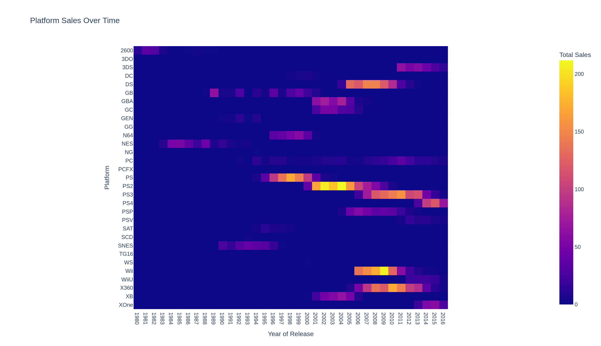

**Purpose:** Visualize the full lifecycle of every platform simultaneously —
when each one launched, peaked, and faded.

**What It Shows**
- X-axis: Year of release (1980–2016)
- Y-axis: Platform (all 31 platforms in the dataset)
- Color intensity: Total sales in that platform-year cell

**Key Insight:** Each platform's sales form a clear "bright band" that rises and
falls, e.g. PS2 peaks around 2001–2004, Wii around 2007–2009, PS4 still rising at
the right edge of the chart (2013–2016).

**Interpretation:** The staggered, overlapping bands confirm a generational
hand-off pattern in the console market — one platform's decline visually overlaps
with its successor's rise, which is the basis for selecting 2013–2016 (the PS4/XOne
launch window) as the forecast-relevant period.

---

## 04. Top 10 Declining Platforms — Trend

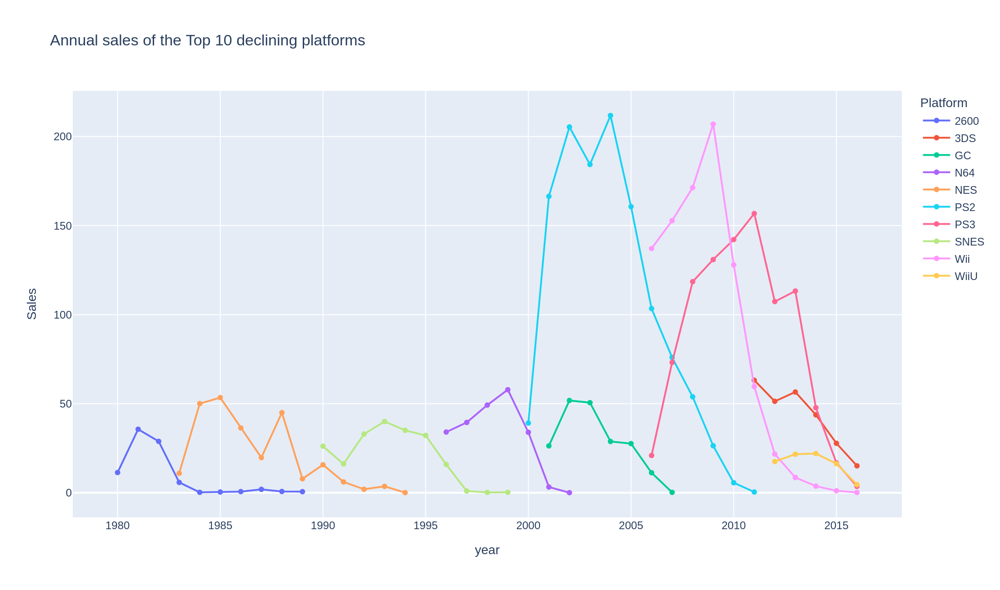

**Purpose:** Show the annual sales trajectory of the 10 platforms with the
largest drop between their first and last active year.

**What It Shows**
- X-axis: Year
- Y-axis: Total sales
- Color: Platform (one line per platform)

**Key Insight:** The steepest declining platforms are dominated by
previous-generation hardware (e.g. PS2, Wii, DS, X360) whose sales fall toward
zero well before 2016.

**Interpretation:** These are the platforms being actively replaced during the
dataset's later years, reinforcing that pre-2013 activity is not representative of
the market a 2017 forecast should be based on.

---

## 05. Discontinued Platforms — Active Period

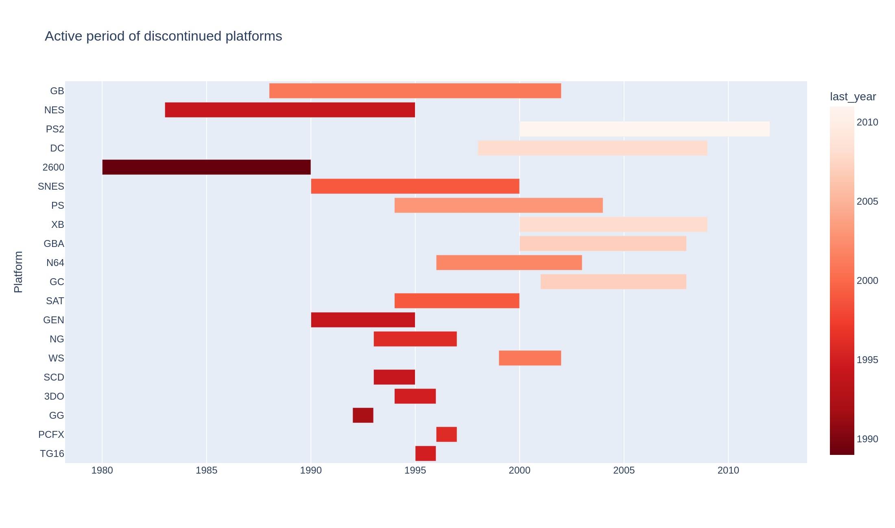

**Purpose:** Show the exact first-to-last active year window for every platform
classified as discontinued (no releases in the last 3 years of the dataset, i.e.
last release year < 2013).

**What It Shows**
- X-axis: Time (first release year → last release year)
- Y-axis: Platform, ordered by most recently discontinued
- Color: Last active year

**Key Insight:** 20 platforms are classified as discontinued by this rule,
including PS2, XB, GBA, GC, PS, N64, and SNES. Median platform lifespan is 6
years (mean 7.6 years, mode 11 years).

**Interpretation:** A ~6–8 year typical console lifecycle, combined with the
clear 2013 PS4/XOne launch, is the direct evidence used to justify treating
2013–2016 as the current console generation for forecasting purposes.

---

## 06. 2017 Sales Forecast — Top Platforms

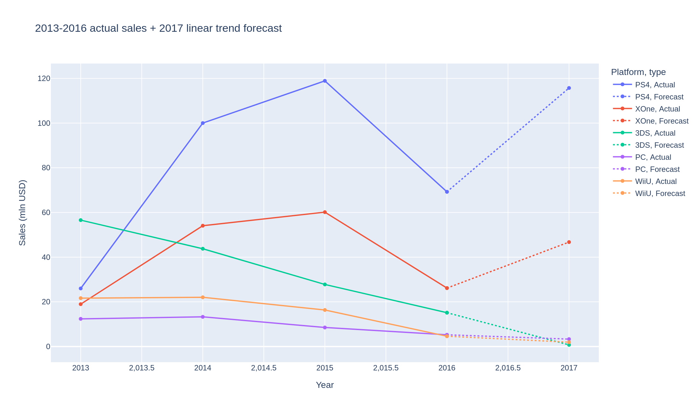

**Purpose:** Compare each top platform's actual 2013–2016 sales against a simple
linear-trend forecast for 2017.

**What It Shows**
- X-axis: Year (2013–2017, with 2017 as the forecast point)
- Y-axis: Sales (millions of USD)
- Color: Platform · Line style: solid (actual) vs. dashed (forecast)

**Key Insight:** The linear-regression forecast (`scipy.stats.linregress`
projected to 2017) predicts continued growth for PS4 (≈115.7M) and XOne
(≈46.7M), while PS3, Wii, X360, and PSP are forecast at or near 0, consistent
with their observed decline.

**Interpretation:** A simple linear trend is sufficient to separate platforms
still gaining momentum (PS4, XOne) from those that have effectively exited the
market, which directly supports the 2017 advertising recommendations in the
main README.

---

## 07. Total Sales by Platform (2013–2016)

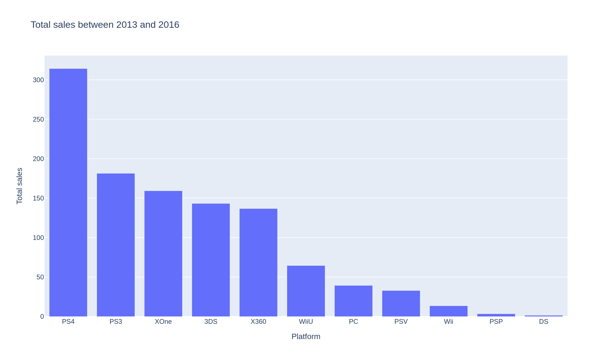

**Purpose:** Rank platforms by total sales within the relevant analysis window
only (2013–2016), rather than all-time.

**What It Shows**
- X-axis: Platform
- Y-axis: Total sales (2013–2016)

**Key Insight:** PS4 leads with 314.14M, followed by PS3 (181.43M), XOne
(159.32M), 3DS (143.25M), and X360 (136.80M).

**Interpretation:** Even within this narrower, more current window, older
platforms (PS3, X360) still hold meaningful sales — but as Chart 06 and Chart 09
show, their trend is downward while PS4/XOne are climbing.

---

## 08. Platform Sales Trend (2013–2016)

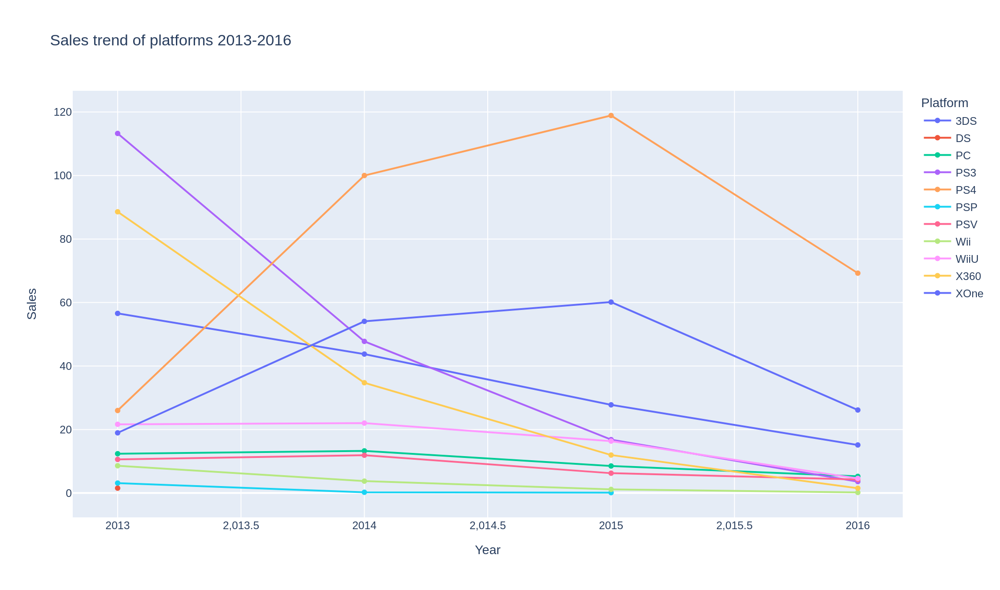

**Purpose:** Show the year-by-year sales trajectory for each platform within the
relevant period, to visually separate growing from declining platforms.

**What It Shows**
- X-axis: Year (2013–2016)
- Y-axis: Total sales
- Color: Platform

**Key Insight:** PS4 and XOne lines rise steadily across all four years, while
PS3, X360, Wii, and DS lines fall.

**Interpretation:** This is the clearest visual confirmation that a platform
generation transition was underway during 2013–2016, motivating the choice of
this window for the forecast.

---

## 09. Platform Year-over-Year Growth Rate

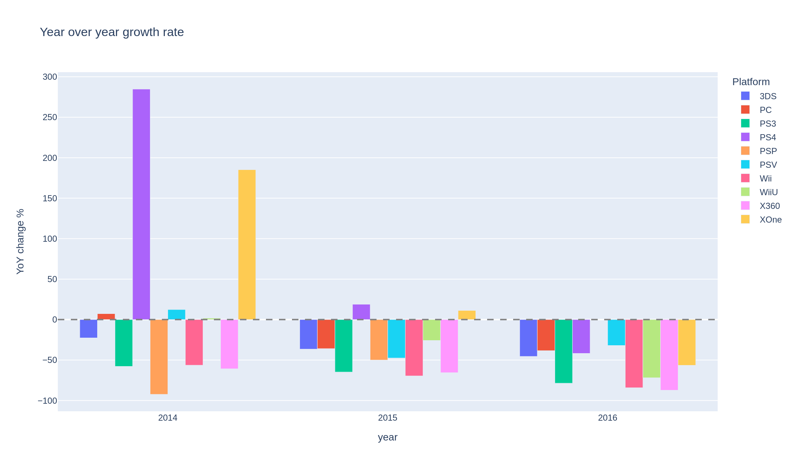

**Purpose:** Quantify each platform's momentum as a percentage change rather than
an absolute sales figure, making growth/decline comparable across platforms of
different sizes.

**What It Shows**
- X-axis: Year
- Y-axis: Year-over-year change in sales (%)
- Color: Platform · Reference line at 0%

**Key Insight:** PS4 and XOne show sustained positive YoY growth in the earlier
years of the window, while legacy platforms show consistently negative YoY
growth.

**Interpretation:** Percentage-based growth confirms the same generational shift
seen in Chart 08, independent of each platform's absolute sales scale.

---

## 10. Sales Distribution by Platform — All-Time (1980–2016)

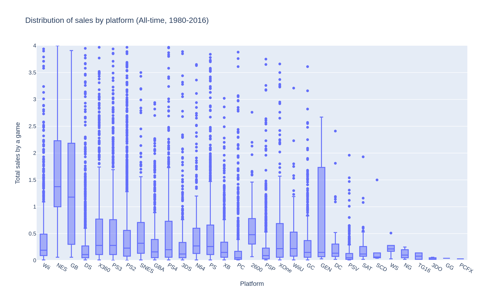

**Purpose:** Show the full distribution (not just the mean) of individual game
sales for each platform across the entire dataset history.

**What It Shows**
- X-axis: Platform
- Y-axis: Total sales per individual game (capped at 4M for readability)
- Box plot: median, quartiles, and outliers per platform

**Key Insight:** Nearly every platform shows a heavily right-skewed
distribution — most games sell a small amount, while a handful of outlier hits
sell far more than the median.

**Interpretation:** This long-tail pattern is a structural feature of the video
game market: platform-level "average" sales are driven disproportionately by a
small number of blockbuster titles.

---

## 11. Sales Distribution by Platform (2013–2016)

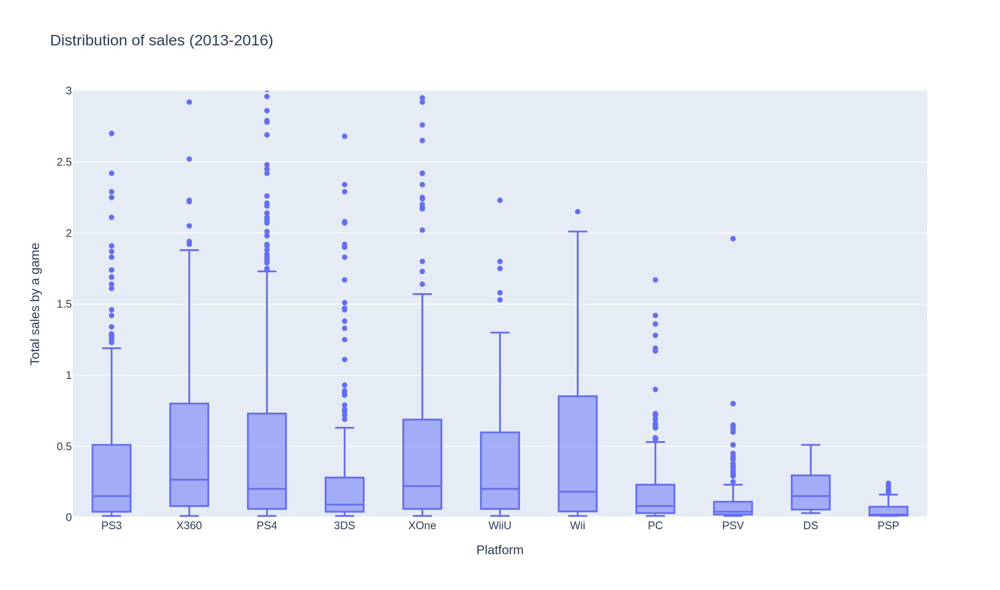

**Purpose:** Repeat the distribution analysis restricted to the relevant
2013–2016 window, to compare current-generation platforms directly.

**What It Shows**
- X-axis: Platform
- Y-axis: Total sales per individual game (capped at 3M)

**Key Insight:** Median sales per game are low across all platforms
(0.02M–0.27M), but PS4 has both the highest mean (0.80M) and highest standard
deviation (1.61M) among platforms in this window.

**Interpretation:** PS4 and X360 show the strongest "hit game" upside, while
PSP/PSV cluster near the bottom, reflecting their declining position in the
market. This matches the summary statistics in `games_relevant_stat`
(see Chart 11's companion table in the notebook, Section 3.5).

---

## 12. PS4: Critic Score vs. Total Sales

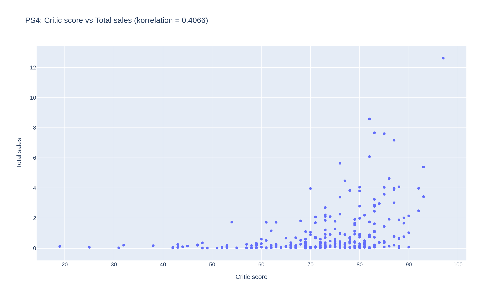

**Purpose:** Test whether professional critic scores are associated with
commercial sales performance for PS4 titles.

**What It Shows**
- X-axis: Critic score (0–100)
- Y-axis: Total sales
- Title includes the computed Pearson correlation coefficient

**Key Insight:** Correlation between `critic_score` and `total_sales` on PS4 is
**r ≈ 0.4066** — a moderate positive relationship.

**Interpretation:** Higher-reviewed PS4 games do tend to sell somewhat more, but
the relationship is moderate, not strong — critic score alone is a weak
predictor of a specific game's commercial success. As emphasized in the
notebook: **correlation is not causation** — marketing budget, franchise
strength, and release timing are plausible confounders that were not measured.

---

## 13. PS4: User Score vs. Total Sales

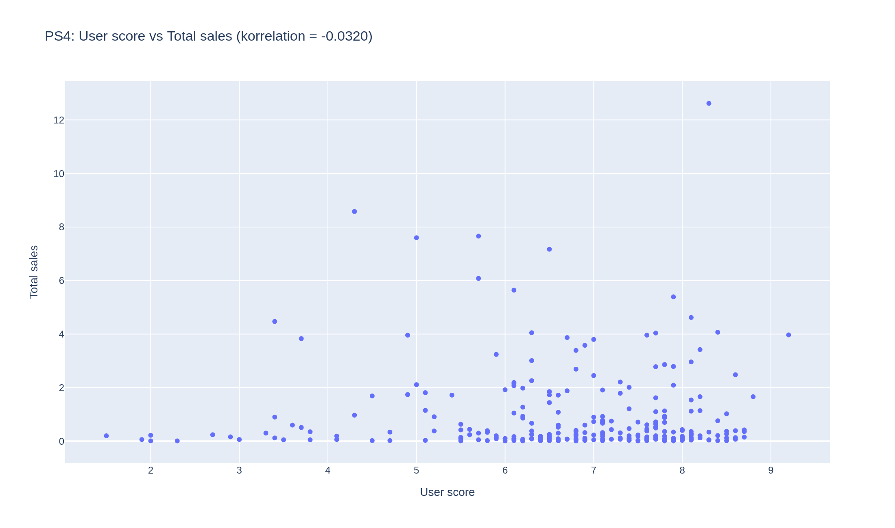

**Purpose:** Test the same relationship as Chart 12, but for user (player)
review scores instead of critic scores.

**What It Shows**
- X-axis: User score (0–10)
- Y-axis: Total sales
- Title includes the computed Pearson correlation coefficient

**Key Insight:** Correlation between `user_score` and `total_sales` on PS4 is
**r ≈ −0.0320** — essentially no linear relationship.

**Interpretation:** Unlike critic scores, user scores show no meaningful
association with sales for PS4 titles. This is a notable asymmetry: professional
reviews carry more sales-relevant signal than player ratings do, at least for
this platform and period.

---

## 14. Top Multi-Platform Games by Platform

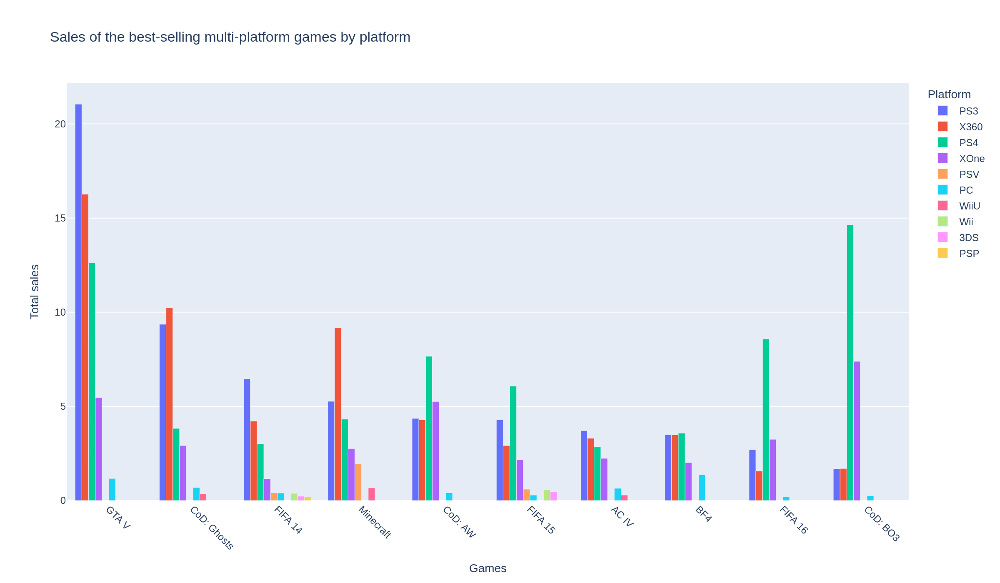

**Purpose:** Compare how the same game title performs across the different
platforms it was released on, for the best-selling multi-platform titles.

**What It Shows**
- X-axis: Game title (abbreviated, e.g. "GTA V", "CoD: BO3", "FIFA 16")
- Y-axis: Total sales
- Color: Platform

**Key Insight:** 2,748 game titles in the full dataset were released on more
than one platform. Among the top 10 best-selling multi-platform titles in the
2013–2016 window, sales are typically split unevenly across platforms rather
than distributed evenly.

**Interpretation:** Even for the same content, the choice of platform materially
changes commercial outcomes — reinforcing that platform-level analysis (not just
genre or title-level) is analytically necessary.

---

## 15. Total Sales by Genre (2013–2016)

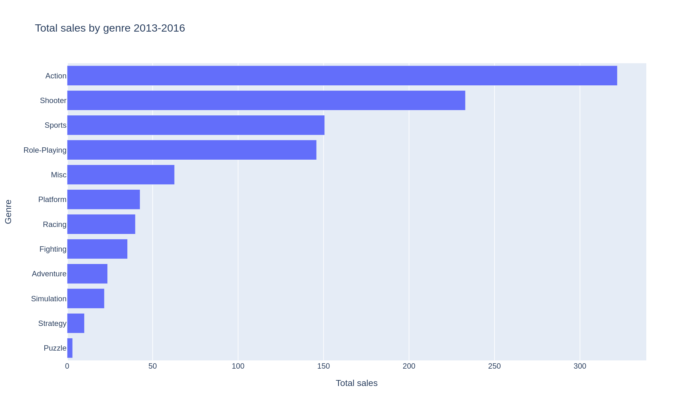

**Purpose:** Rank genres by total commercial sales within the relevant analysis
period.

**What It Shows**
- X-axis: Total sales
- Y-axis: Genre (horizontal bars, sorted ascending)
- Hover data: Market share (%)

**Key Insight:** `Action` leads with 321.87M (≈29.5% market share), followed by
`Shooter` (232.98M, 21.4%), `Sports` (150.65M, 13.8%), and `Role-Playing`
(145.89M, 13.4%). `Simulation`, `Strategy`, and `Puzzle` are the smallest
genres.

**Interpretation:** Action and Shooter together account for roughly half of all
sales in the relevant period, driven by both high release volume and strong
per-game performance — while Strategy/Puzzle serve small, niche audiences.

---

## 16. Genre Sales Ranking (Funnel View)

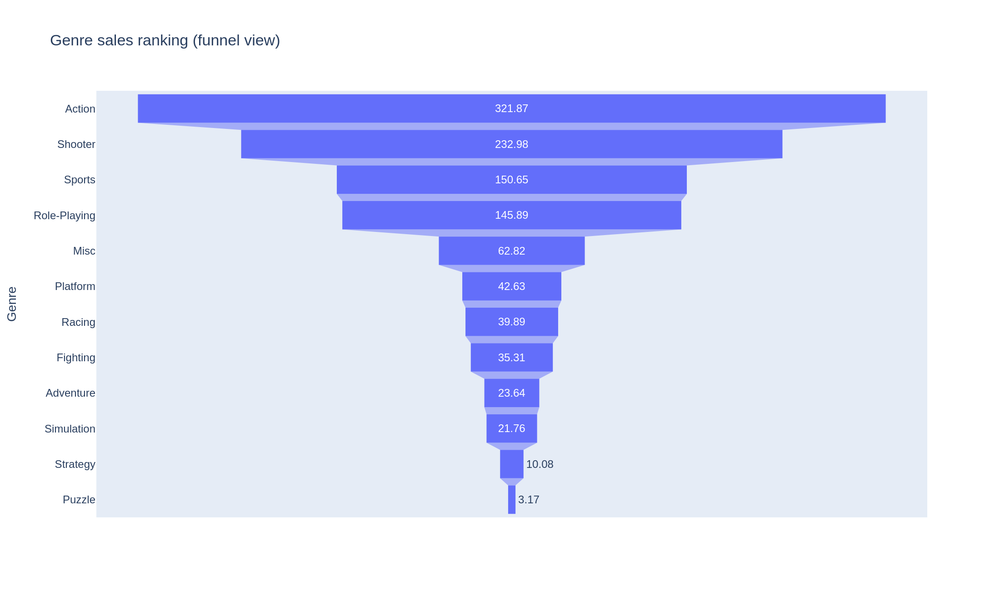

**Purpose:** Present the same genre ranking as Chart 15 in a funnel layout that
visually emphasizes the steep drop-off between top and bottom genres.

**What It Shows**
- Funnel stages ordered from highest to lowest total sales by genre
- Hover data: Market share (%)

**Key Insight:** The funnel shape makes the concentration explicit — sales drop
sharply after the top 3–4 genres (Action, Shooter, Sports, Role-Playing), with
the remaining 8 genres contributing comparatively little.

**Interpretation:** Genre-level demand in this market is concentrated, not
evenly spread — a small set of genres captures most commercial value.

---

## 17. Top 8 Platforms — Regional Comparison

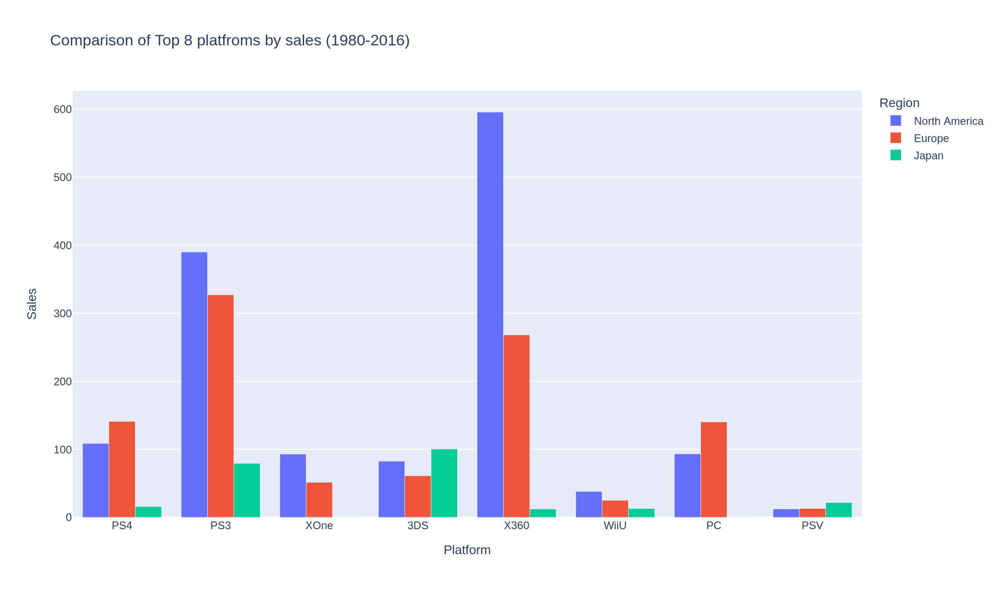

**Purpose:** Compare how the top-selling platforms perform across North
America, Europe, and Japan simultaneously.

**What It Shows**
- X-axis: Platform (top 8 by total sales)
- Y-axis: Sales
- Color: Region (NA / EU / JP)

**Key Insight:** PS4 and XOne sell strongly in NA and EU but comparatively
little in Japan, while 3DS and PS3 have a much larger relative share of Japanese
sales.

**Interpretation:** Regional platform preference is not uniform — Western
markets favor home consoles from PlayStation/Xbox, while Japan shows
comparatively stronger demand for handheld and PlayStation-brand hardware
(3DS, PSV, PS3), foreshadowing the ESRB/genre regional splits in Charts 18–19.

---

## 18. ESRB Rating — Sales Comparison by Region (2013–2016)

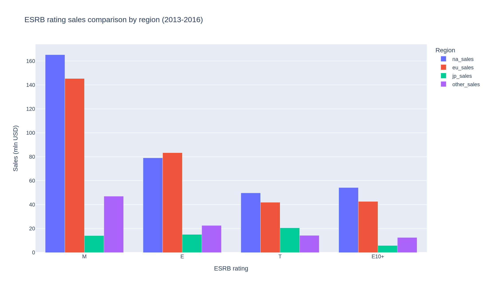

**Purpose:** Test whether the age-rating profile of best-selling games differs
by region.

**What It Shows**
- X-axis: ESRB rating (E, E10+, T, M)
- Y-axis: Sales (millions of USD)
- Color: Region (grouped bars)

**Key Insight:** `M` (Mature) rated games lead sales in NA (165.21M) and EU
(145.32M). Japan is the outlier, led instead by `T` (Teen) rated games (20.59M),
with `E` (15.14M) close behind and `M` last (14.11M).

**Interpretation:** ESRB rating impact is region-specific: Western audiences
lean toward mature content, while Japan's top-selling games skew toward
broader-audience ratings — consistent with the Role-Playing genre preference
seen in the regional genre analysis.

---

## 19. Action vs. Sports — Spread of User Score

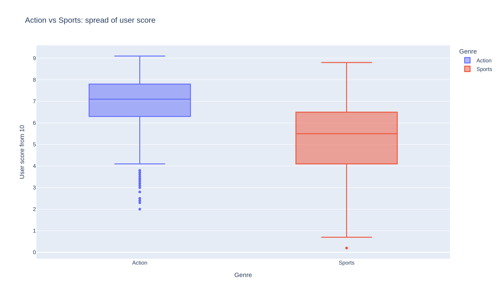

**Purpose:** Visually support the hypothesis test comparing average user
ratings between the Action and Sports genres.

**What It Shows**
- X-axis: Genre (Action, Sports)
- Y-axis: User score (0–10)
- Box plot: median, quartiles, and spread per genre, color-coded by genre

**Key Insight:** Action games (n=389) have a visibly higher median and overall
distribution (mean ≈ 6.84) than Sports games (n=160, mean ≈ 5.24). A Welch's
t-test on this data returned t ≈ 10.233, p ≈ 1.45×10⁻²⁰, far below α = 0.05.

**Interpretation:** The difference is statistically highly significant — H0 is
strongly rejected. Action games are rated meaningfully higher by users than
Sports games on average. One plausible explanation raised in the notebook is
that Sports titles often follow annual roster-update release cycles with less
year-to-year innovation than Action titles, though this remains an
interpretation, not proven causation.

